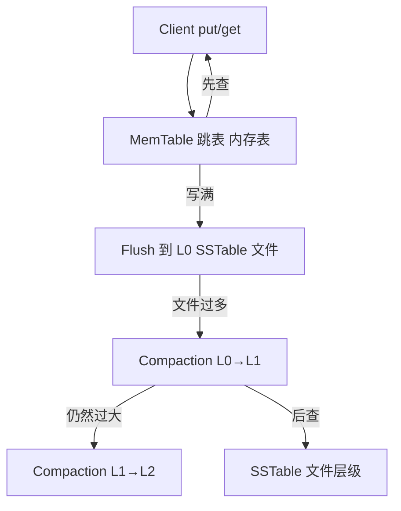

# Zig LSM Tree 教学项目

[](https://ziglang.org)

一个**最小但完整**的 LSM-Tree（Log-Structured Merge Tree）实现，专为学习存储引擎原理而设计。代码量控制在可一次性读完的范围内，覆盖了 LSM-Tree 最核心的三个组件：**MemTable（跳表）**、**SSTable（磁盘有序表）**、**Compaction（层级合并）**。

> 如果你刚接触 LSM-Tree，建议先阅读 [LSM-TREE-PRINCIPLES.md](LSM-TREE-PRINCIPLES.md)，了解背景知识后再来看代码。

## 你将学到什么

1. **为什么 LSM-Tree 写入快**：所有写操作先追加到内存中的 MemTable，再批量顺序刷新到磁盘。
2. **MemTable 如何用跳表实现**：在内存中维护一个有序结构，支持 O(log n) 的查找和插入。
3. **SSTable 如何持久化**：键值对按 key 有序写入文件，并建立内存索引加速点查。
4. **Compaction 如何解决读放大**：当低层文件过多时，把多个 SSTable 合并成一个更大的 SSTable，同时清理旧值。
5. **Zig 中的内存所有权**：本项目的 `get()` 返回由调用方负责释放的内存，所有示例和测试都演示了 `defer allocator.free(value)` 的用法。

## 架构图



## 快速开始

### 环境要求

- [Zig](https://ziglang.org) 0.16.0 或更高版本

### 构建与运行

```bash
zig build

zig build run

zig build test
```

## 项目结构

```text
src/
  ├── root.zig          # 库入口，导出所有公共类型
  ├── main.zig          # 示例程序：演示基本 API
  ├── lsm.zig           # LSM-Tree 核心实现（MemTable + SSTable 层级 + Compaction）
  ├── memtable.zig      # 基于跳表的有序内存表
  ├── sstable.zig       # 磁盘有序字符串表（SSTable）
  └── lsm_test.zig      # 集成测试：触发多层级 Compaction
```

## 使用示例

```zig
const std = @import("std");
const LSMTree = @import("zig_lsm_tree_lib").LSMTree;

pub fn main() !void {
    var gpa = std.heap.GeneralPurposeAllocator(.{}){};
    defer _ = gpa.deinit();
    const allocator = gpa.allocator();

    var lsm = try LSMTree.init(allocator);
    defer lsm.deinit();

    try lsm.put("hello", "world");
    try lsm.put("lsm", "tree");

    // 注意：get 返回的内存需要调用方释放
    if (try lsm.get("hello")) |value| {
        defer allocator.free(value);
        std.debug.print("hello = {s}\n", .{value});
    }
}
```

## 核心概念

### 1. MemTable（内存表）

MemTable 是所有写操作的第一站。它使用**跳表（Skip List）**维护 key 的有序性，提供近似 O(log n) 的查询和插入效率。

关键参数：

- `MAX_MEMTABLE_SIZE = 256`：MemTable 最多存储 256 条记录，达到上限后触发 flush。
- 跳表最大高度 `MAX_LEVEL = 16`，晋升概率 `P = 0.5`。

### 2. SSTable（磁盘有序表）

当 MemTable 写满时，会顺序刷新成一个不可变的 SSTable 文件。文件格式非常简单：

| 字段 | 长度 | 说明 |
|------|------|------|
| key_len | u32 | key 长度 |
| key | 可变 | key 字节 |
| value_len | u32 | value 长度 |
| value | 可变 | value 字节 |
| sequence | u64 | 全局单调序列号 |

SSTable 在内存中维护一个 `StringHashMap<key, offset>`，实现 O(1) 的文件定位。

### 3. Compaction（层级合并）

项目采用**简化版 Leveled Compaction**：

- Level 0 最多容纳 4 个 SSTable（`L0_COMPACTION_THRESHOLD = 4 * MAX_MEMTABLE_SIZE = 1024` 条记录）。
- 更高层容量按 `LEVEL_SIZE_MULTIPLIER = 10` 递增。
- 合并时，把当前层和下一层的所有记录读入内存，按 key 排序并保留同一 key 的最新序列号，然后写入新的 SSTable。

> 这是一个**教学简化模型**：真实数据库会采用分段文件、并行合并、Bloom Filter 等优化。本项目刻意保持简单，方便你理解主流程。

## 内存所有权约定

为了与 Zig 显式内存管理风格一致，本项目的 API 约定如下：

| 函数 | 返回值 | 释放责任 |
|------|--------|----------|
| `LSMTree.init(allocator)` | `*LSMTree` | 调用 `lsm.deinit()` |
| `LSMTree.get(key)` | `?[]const u8` | 调用方使用**传入 `init` 的 allocator** `free` |
| `LSMTree.put(key, value)` | `void` | 函数内部完成复制，调用方无需管理 key/value 副本 |
| `SSTable.get(key)` | `?[]const u8` | 调用方 free |

所有示例和测试都遵循这个约定，可以直接作为参考。

## 运行测试

```bash
zig build test
```

测试覆盖：

1. **MemTable 基本操作**：插入、查询、更新。
2. **SSTable 基本操作**：写入、按 key 读取、读取不存在的 key。
3. **LSMTree 基本操作**：put/get、内存表刷新。
4. **LSMTree 多层级操作**：大量写入触发 L0→L1 甚至 L1→L2 的 Compaction。
5. **Compaction 行为**：验证合并后数据一致性以及层级大小比例。

## 已知限制与扩展方向

本项目为教学而生，刻意保留以下简化：

- 没有 WAL（Write-Ahead Log），崩溃会丢失内存中的数据。
- 没有 Bloom Filter，读取可能需要扫描多层 SSTable。
- 没有范围查询 API（`scan`）。
- 没有并发控制（单线程模型）。
- Compaction 合并时会把所有数据读入内存，不适用于生产环境的大数据集。

扩展方向：

1. 实现 WAL，保证持久性。
2. 添加 Bloom Filter，减少无效的 SSTable 查找。
3. 实现 `scan(start, end)` 范围查询。
4. 把 Compaction 放到独立线程或协程中异步执行。
5. 引入分块 SSTable（block-based index），避免一次性加载全表。

## 许可证

MIT License — 详见 [LICENSE](LICENSE) 文件（如未找到，可自行添加一份 MIT 许可证）。
